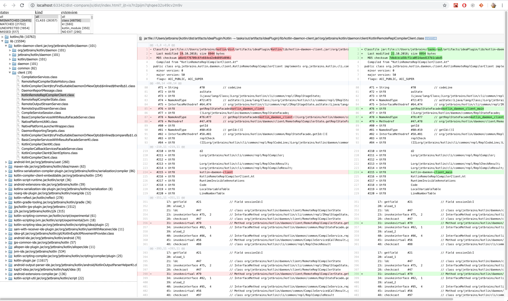

Tool for compare and analyze build artifacts.
Created and used to fix diffirences between JPS and Gradle build of Kotlin project.



Build:
- `gradlew build`

How to use:
- download latest release https://github.com/snrostov/dist-compare/releases/tag/0.1
- call `dist-compare <expected-dir> <actual-dir> <reports-dir>`
- after all files are analyze report will be displayed in browser

How it works:
- FS traversed using `commons-vfs2`, including contents of `jars`
- Class files readed using `javap` API and converted to text
- Diff generated using `com.github.wumpz.diffutils` and saved as unified `.patch` files
- Status of all files saved in JSON:
```json
{
  "id": 52837,
  "relativePath": "/lib/kotlin-script-util.jar/org/jetbrains/kotlin/script/util/KotlinAnnotatedScriptDependenciesResolver.class",
  "noExtension": false,
  "extension": "class",
  "status": "MISMATCHED",
  "kind": "CLASS",
  "suppressed": false
}
```
- JSON loaded in JS app with applied filters and tree of files built.
- Tree is displayed in UI using `fancytree`
- Selected item displayed as html using `jquery.diff2html`